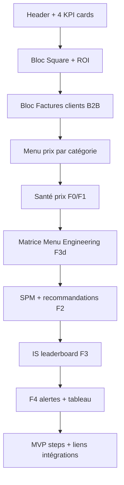

# Documentation design — page Statistiques (`/dashboard/stats`)

Brief pour **Claude Design** (ou tout redesign UI) : inventaire des graphiques, données, couleurs, états vides et pistes d’amélioration.

**Références code**

| Ressource | Chemin |
|----------|--------|
| Page | [`app/dashboard/stats/page.tsx`](../app/dashboard/stats/page.tsx) |
| Thème / tokens | [`DESIGN.md`](../DESIGN.md) |
| Formules pricing (PDF produit) | F0–F4 (Plate Cost, IRR, SPM, IS, Prix Final) |

**Librairie graphiques** : [Recharts](https://recharts.org/) 2.x (`ResponsiveContainer`, grilles `h-72` / `h-96`).

---

## Contexte produit

RestoPrix aide les restaurateurs québécois à fixer leurs prix. La page **Statistiques** regroupe :

1. **Ventes POS** (import CSV Square)
2. **Facturation B2B** (factures clients importées)
3. **Structure du menu** (onboarding)
4. **Moteur de pricing** (formules F0–F4 : rentabilité, marché, suggestions, alertes)

La page est **longue** (~8 blocs empilés, scroll vertical). Largeur conteneur : `max-w-5xl`.

---

## Navigation et filtres globaux

| Élément | Détail |
|---------|--------|
| Route | `/dashboard/stats` |
| Menu latéral | Libellé « Statistiques » ([`app-sidebar.tsx`](../components/dashboard/app-sidebar.tsx)) |
| Filtre période | Query `?range=7d` \| `30d` \| `90d` (défaut **30d**) |
| Sections utilisant `range` | Square, Factures B2B, tout le bloc pricing F0–F4 |
| Sections **sans** `range` | Menu (prix par catégorie) — snapshot onboarding uniquement |

**Sélecteur période (UI actuelle)** : pills texte en haut à droite des blocs Square et B2B — bordure, état actif `border-primary bg-primary/10 text-primary`.

---

## Ordre d’affichage (haut → bas)

---

## Patterns UI récurrents

| Pattern | Classes / style |
|---------|-----------------|
| Carte section | `rounded-lg border bg-card p-6 text-card-foreground` |
| Grille 2 graphiques | `grid gap-8 lg:grid-cols-2` |
| Grille 4 KPI | `grid gap-4 sm:grid-cols-2 lg:grid-cols-4` |
| Stat interne | `rounded-md border p-3` + label uppercase `text-xs text-muted-foreground` |
| Empty state graphique | `h-72` (ou `h-64`) + `border border-dashed` + texte centré `text-muted-foreground` |
| Empty state section | `border-dashed border-primary/20` + icône dans carré `bg-primary/10` + CTA bouton |
| Grille cartes | `stroke="hsl(var(--border))"` · `strokeDasharray="3 3"` |

**Tokens couleur chart (CSS variables)**

| Token | Usage typique |
|-------|----------------|
| `--primary` | Série principale, pills actives |
| `--chart-2` | 2e série (ex. ventes brutes, barres secondaires) |
| `--chart-3` | Transactions Square |
| `--chart-4` | Taxes |
| `--chart-5` | Palette B2B (taxes mix) |
| `--muted` | Barres volume factures |
| `--muted-foreground` | Axes, labels secondaires |
| `--border` | Grilles Recharts |

**Couleurs sémantiques pricing (hardcodées aujourd’hui — à unifier avec DESIGN.md)**

| Sémantique | HSL actuel | Contexte |
|------------|------------|----------|
| Rentable / positif | `hsl(152 72% 35%)` | IRR ≥ 65 %, STAR, SPM optimal |
| Surveillance / attention | `hsl(45 90% 52%)` | IRR 45–65 %, PLOWHORSE, hors marché |
| Marge faible / coût | `hsl(25 92% 55%)` | IRR 30–45 %, PlatCost waterfall |
| Perte / critique | `hsl(0 78% 58%)` | IRR < 30 %, DOG, SPM trop bas |
| Puzzle | `hsl(200 84% 45%)` | Quadrant PUZZLE scatter |

---

## 0. En-tête + KPI cards

**Composant** : inline dans [`stats/page.tsx`](../app/dashboard/stats/page.tsx).

| Carte | Label | Source données |
|-------|-------|----------------|
| 1 | Restaurant | `onboarding.restaurant_name` |
| 2 | Profil | Dominant / Chasseur / Sécuritaire (onboarding) |
| 3 | Items menu | Nombre d’articles menu |
| 4 | Prix moyen | Moyenne `price_cad` du menu |

**Type** : pas de graphique — 4 cartes texte dans une grille responsive.

**Design note** : pas de lien vers filtre période ni indicateur de fraîcheur des données.

---

## 1. Square (ventes POS)

**Section** : [`square-analytics.tsx`](../components/dashboard/square-analytics.tsx)  
**Carte principale** : [`square-revenue-card.tsx`](../components/dashboard/square-revenue-card.tsx)

### État vide

- Titre : « Importe ton rapport Square pour activer les graphiques »
- CTA : lien vers `/dashboard/integrations/square`
- Style : carte dashed `border-primary/20`

### Si données présentes

#### 1.1 Graphique — Montants encaissés

| Attribut | Valeur |
|----------|--------|
| Fichier | [`square-revenue-chart.tsx`](../components/dashboard/square-revenue-chart.tsx) |
| Type | **LineChart** |
| Titre section | « Montants encaissés » |
| Hauteur | `h-72` (288px) |
| Axe X | `day` (ISO date) — format `fr-CA` court (ex. « 15 mai ») |
| Axe Y | Montants CAD, 0 décimale |
| Séries | `netSales` (Ventes nettes), `grossSales` (Ventes brutes), `taxes` (si au moins une valeur > 0) |
| Couleurs | primary, chart-2, chart-4 |
| Empty | « Aucune donnee Square recue pour cette periode. » |

**Données** : `SquareRevenuePoint[]` depuis `square_sales_reports` ([`lib/square/dashboard.ts`](../lib/square/dashboard.ts)).

#### 1.2 Graphique — Volume (transactions)

| Attribut | Valeur |
|----------|--------|
| Fichier | [`square-transactions-chart.tsx`](../components/dashboard/square-transactions-chart.tsx) |
| Type | **LineChart** (une ligne) |
| Titre | « Volume (transactions) » |
| Hauteur | `h-64` |
| Axe X | `day` |
| Axe Y | `transactions` (entiers) |
| Couleur | chart-3 |
| Empty | « Aucune donnée pour cette période. » |

#### 1.3 Stats (4 cartes, pas graphique)

Dans l’en-tête de la section Square :

- Ventes nettes (total période)
- Moyenne / jour
- Transactions (total)
- Taxes (période)

#### 1.4 ROI RestoPrix (pas graphique)

**Fichier** : [`roi-card.tsx`](../components/dashboard/roi-card.tsx)

| État | Contenu |
|------|---------|
| Sans suggestions acceptées | Message + formule ROI en `code` |
| Avec données | 3 stats : gain mensuel estimé, coût abonnement, gain net (+ ratio vs abonnement) |

**Données** : `pricing_suggestions` acceptées + constante abonnement.

**Piste design** : visualiser le ROI (jauge, barre comparatif abonnement vs gain) au lieu de 3 chiffres seuls.

---

## 2. Factures clients (B2B)

**Section** : [`client-invoice-analytics-section.tsx`](../components/dashboard/client-invoice-analytics-section.tsx)  
**Graphiques** : [`client-invoice-charts.client.tsx`](../components/dashboard/client-invoice-charts.client.tsx)

### État vide

- Titre : « Factures clients pour le CA B2B »
- CTA : `/dashboard/integrations/client-invoices`

### Si données présentes

**Stats (3 cartes)** : factures (période), total facturé, CA moyen / facture.

#### 2.1 CA et volume par jour

| Attribut | Valeur |
|----------|--------|
| Type | **ComposedChart** |
| Titre | « CA et volume par jour » |
| Hauteur | `h-72` |
| Axe X gauche (CAD) | `totalCad` — ligne monotone primary |
| Axe Y droit (count) | `invoiceCount` — barres muted |
| Empty | « Aucune facture dans cette période. » |

#### 2.2 Top clients

| Attribut | Valeur |
|----------|--------|
| Type | **BarChart** layout vertical |
| Titre | « Top clients » |
| Hauteur | `h-72` |
| Donnée | `totalCad` par `clientKey` (libellé tronqué 32 car.) |
| Couleur | primary |
| Empty | « Pas encore de clients identifiés. » |

#### 2.3 Articles / services facturés

| Attribut | Valeur |
|----------|--------|
| Type | **BarChart** horizontal |
| Titre | « Articles / services facturés » |
| Donnée | `totalCad` par ligne de facture (`label` tronqué 40 car.) |
| Couleur | chart-2 |
| Empty | message si pas de lignes détaillées |

#### 2.4 Taxes déclarées (conditionnel)

| Attribut | Valeur |
|----------|--------|
| Type | **BarChart** vertical |
| Affichage | Uniquement si `taxMix` a des montants > 0 |
| Hauteur | `h-56 max-w-xl` |
| Couleurs | 6 couleurs rotatives (`CHART_COLORS` : primary, chart-2…chart-5, chart-other) |
| Labels X | rotation -18° |

**Données** : table `client_invoices`, champ `ai_extraction` JSON — agrégation [`client-invoice-charts.ts`](../lib/dashboard/client-invoice-charts.ts).

---

## 3. Menu — prix par catégorie

**Composant** : [`menu-charts.client.tsx`](../components/dashboard/menu-charts.client.tsx)  
**Condition** : affiché seulement si `menuItems.length > 0`.

**Titre section** : « Menu (prix par catégorie) »  
**Sous-titre** : données onboarding, comparaison indicative au mix Square.

| # | Titre | Type | dataKey | Couleur |
|---|-------|------|---------|---------|
| 3.1 | Prix moyen par catégorie | BarChart vertical | `avgPriceCad` | primary |
| 3.2 | Nombre d'articles par catégorie | BarChart vertical | `itemCount` | chart-2 |

**Layout** : 2 colonnes `lg:grid-cols-2`, hauteur `h-72` chacune.

**Axe X** : `categoryShort` (tronqué à 22 car. + « … »), angle -16°, `textAnchor="end"`.

**Données** : [`buildMenuCategoryChartPoints`](../lib/dashboard/menu-charts.ts) — agrégation par `category` depuis `restaurant_menu_items`.

**Pas de filtre 7/30/90j** — snapshot statique du menu.

---

## 4. Santé prix (F0 / F1)

**Section** : [`pricing-f0f1-section.tsx`](../components/dashboard/pricing-engine/pricing-f0f1-section.tsx)  
**Loader** : [`f0f1-insights.ts`](../lib/dashboard/pricing-engine/f0f1-insights.ts)  
**Formules** : [`lib/pricing-engine/math.ts`](../lib/pricing-engine/math.ts)

### Bloc intro (texte)

- Titre : « Santé prix (F0/F1) »
- Messages : état Square (ok / manquant / erreur), fixes mensuels hypothèse, volume mensuel estimé

### F0 — Plate Cost (estimé)

Coût matière **estimé** par catégorie de plat (`foodCostPct` par mot-clé catégorie) × `PrixNet`, faute de recettes/factures fournisseur complètes.

**Confiance affichée** : `estimé` | `incomplet` (selon Square).

### F1 — IRR par plat

`IRR (%) = (PrixNet − PlatCost − MO − Fixe) / PrixNet × 100`

Inclut TVA QC (÷ 1,14975), frais POS, MO batch, fixes ajustés au volume.

| Seuil IRR | Verdict | Couleur barre |
|-----------|---------|---------------|
| ≥ 65 % | rentable | vert |
| 45–65 % | surveillance | jaune |
| 30–45 % | marge_faible | orange |
| < 30 % | perte | rouge |

#### 4.1 Graphique — IRR (%) par plat

| Attribut | Valeur |
|----------|--------|
| Fichier | [`irr-bar-chart.client.tsx`](../components/dashboard/pricing-engine/irr-bar-chart.client.tsx) |
| Type | **BarChart** horizontal |
| Sous-titre | « IRR (%) par plat (F1) » |
| Limite | Top **12** plats (tri IRR décroissant) |
| Hauteur carte | `h-96` |
| Empty | « Aucune donnée pour calculer l'IRR. » |

#### 4.2 Graphique — Composition revenus / coûts

| Attribut | Valeur |
|----------|--------|
| Fichier | [`cost-waterfall.client.tsx`](../components/dashboard/pricing-engine/cost-waterfall.client.tsx) |
| Type | **BarChart** horizontal empilé (`stackId`, `stackOffset="sign"`) |
| Sous-titre | « Composition revenus / coûts (F0 + MO/Fixes) » |
| Limite | Top **10** plats |
| Séries empilées | `priceNetCad` (+), `platCostCadNeg`, `moCadNeg`, `fixeCadNeg` (−) |
| Couleurs | vert (net), orange (plat), jaune (MO), rouge (fixes) |

**Piste design** : vrai waterfall avec connecteurs ; légende explicite ; tooltip détaillé par composante.

**Layout section** : intro pleine largeur + grille `lg:grid-cols-2` pour 4.1 et 4.2.

---

## 5. Matrice Menu Engineering (F3d)

**Section** : [`pricing-f3d-section.tsx`](../components/dashboard/pricing-engine/pricing-f3d-section.tsx)  
**Graphique** : [`menu-engineering-f3d.client.tsx`](../components/dashboard/pricing-engine/menu-engineering-f3d.client.tsx)

| Attribut | Valeur |
|----------|--------|
| Type | **ScatterChart** |
| Titre | « Matrice Menu Engineering (F3d) » |
| Hauteur | `420px` |
| Axe X | Volume mensuel estimé (allocation Square proportionnelle au prix) |
| Axe Y | IRR % |
| Seuils | Lignes pointillées : `seuilVolume` (= 70 % vol. moyen), `seuilMarge` (= IRR moyen carte) |
| Séries (4 scatter) | STAR, PLOWHORSE, PUZZLE, DOG — couleurs distinctes |
| Sous-graphique | 4 cartes texte rappelant chaque quadrant |

**Quadrants (Kasavana & Smith)**

| Quadrant | Condition | Action produit |
|----------|-----------|----------------|
| STAR | vol ≥ seuil, IRR ≥ seuil | Protéger, promouvoir |
| PLOWHORSE | vol ≥ seuil, IRR < seuil | Revoir recette ou prix |
| PUZZLE | vol < seuil, IRR ≥ seuil | Promouvoir |
| DOG | vol < seuil, IRR < seuil | Candidat retrait |

**Empty** : « Aucune donnée F3d disponible. »

**Piste design** : fond quadrants colorés légers ; labels plats au survol ; regroupement si trop de points.

---

## 6. Positionnement marché — SPM (F2)

**Section** : [`pricing-f2-section.tsx`](../components/dashboard/pricing-engine/pricing-f2-section.tsx)  
**Graphique** : [`spm-bar-chart.client.tsx`](../components/dashboard/pricing-engine/spm-bar-chart.client.tsx)  
**Loader** : [`f2-spm-insights.ts`](../lib/dashboard/pricing-engine/f2-spm-insights.ts)

**Formule** : `SPM (%) = (MonPrix − RefMarché) / RefMarché × 100`

| SPM | Verdict | Couleur |
|-----|---------|---------|
| < −15 % | trop_bas | rouge |
| −15 % à +10 % | zone_optimal | vert |
| > +10 % | hors_marche | jaune |

**RefMarché** : prix concurrents du dernier run scraping (`scrape_run_items`), match nom plat, κ par type restaurant.

#### 6.1 Graphique — SPM (%)

| Attribut | Valeur |
|----------|--------|
| Type | **BarChart** horizontal |
| Limite | 12 plats avec SPM calculable |
| Références | `ReferenceLine` à −15 % et +10 % |
| Hauteur | `360px` |
| Empty | « SPM indisponible (pas de concurrents). » |
| Note pied | seuils PDF rappelés en `text-xs` |

#### 6.2 Recommandations (pas graphique)

3 colonnes listes (max 6 plats chacune) :

- Trop bas
- Zone optimale
- Hors marché

**Dépendance données** : admin `/admin/scraping` — sans run réussi, SPM vide pour tous les plats.

---

## 7. Indice de suggestion — IS (F3)

**Section** : [`pricing-f3-section.tsx`](../components/dashboard/pricing-engine/pricing-f3-section.tsx)  
**Loader** : [`f3-is-insights.ts`](../lib/dashboard/pricing-engine/f3-is-insights.ts)

**Formule (résumé)** : IS normalisé 0–100 à partir de volume, IRR, prix net, tendance lissée, élasticité proxy.

| IS | Verdict | Badge couleur |
|----|---------|---------------|
| ≥ 75 | mettre_en_avant | vert |
| 40–75 | maintenir | ambre |
| < 40 | revoir_ou_retirer | rouge |

### 7.1 Compteurs (3 cartes)

- Mettre en avant (count)
- Maintenir (count)
- Revoir / retrait (count)

### 7.2 Tableau — Top suggestions (IS)

| Colonne | Contenu |
|---------|---------|
| # | Rang 1–12 |
| Plat | `item_name` |
| IS | Score 0–100, 1 décimale |
| Verdict | Badge coloré |
| IRR | % |

**Pas de graphique barres IS** — opportunité : leaderboard horizontal ou bar chart IS.

---

## 8. Prix final et alertes (F4)

**Section** : [`pricing-f4-section.tsx`](../components/dashboard/pricing-engine/pricing-f4-section.tsx)  
**Moteur** : [`f4.ts`](../lib/pricing-engine/f4.ts) · [`f4-insights.ts`](../lib/dashboard/pricing-engine/f4-insights.ts)

Arbre de décision : plancher/plafond, alertes C1–C3, gel, O1, A1.

| Code | Signification | Badge (couleur actuelle) |
|------|---------------|---------------------------|
| C1 | Plancher > Plafond — plat suspendu | rouge |
| C2 | IRR < 30 % — perte | rouge |
| C3 | Δ coût fournisseur ≥ 15 % | rouge |
| GEL | ≥ 3 ajustements / 28 j | ambre |
| O1 | Opportunité (prix < cible, bonne marge) | emerald |
| A1 | Suggestion changement de prix | primary |
| NO_CHANGE | Aucun changement | muted |

### 8.1 Compteurs (3 cartes)

- A1 (ajustements suggérés)
- O1 (opportunités)
- C2 (pertes)

### 8.2 Tableau — Top 14 décisions

Colonnes : Plat, Action (badge), Prix (actuel → suggéré si A1), IRR, SPM.

**Piste design (PDF)** : bande de prix Plancher — Actuel — Cible — Plafond ; timeline ajustements ; carte gain O1.

**Backend** : profil **Sécuritaire** génère suggestions via F4 (pas LLM) dans [`run-pricing-suggestions-generation.ts`](../lib/dashboard/run-pricing-suggestions-generation.ts).

---

## 9. Pied de page (hors graphiques)

- Liste « Prochaines étapes produit » (MVP)
- Boutons : Import CSV Square, Factures clients

---

## Synthèse quantitative

| Bloc | Graphiques Recharts | Tableaux | KPI / stats |
|------|---------------------|----------|-------------|
| Square | 2 lignes | 0 | 4 + ROI (3) |
| B2B | 4 (1 composé) | 0 | 3 |
| Menu | 2 barres | 0 | 0 |
| F0/F1 | 2 barres | 0 | intro texte |
| F3d | 1 scatter | 0 | 4 légendes |
| F2 | 1 barres | 3 listes | 0 |
| F3 | 0 | 1 | 3 compteurs |
| F4 | 0 | 1 | 3 compteurs |
| Header | 0 | 0 | 4 |
| **Total** | **12** | **2** | **~22** |

---

## Problèmes UX à traiter (brief design)

1. **Longueur** : ~8 sections sans ancres, onglets ni regroupement « Ventes » vs « Menu & pricing ».
2. **Répétition visuelle** : nombreuses barres horizontales similaires (IRR, SPM, B2B clients/lignes).
3. **F3 / F4** : tableaux là où le produit visait leaderboard / range charts / bandes de prix.
4. **Couleurs** : sémantique pricing en HSL fixe — à mapper sur tokens DESIGN.md (`semantic-success`, `semantic-warning`, `semantic-error`, `chart-*`).
5. **Confiance données** : peu visible (F0 estimé, SPM sans concurrents) — badges / bandeau global recommandés.
6. **Filtre période** : absent sur Menu ; présent ailleurs — risque de confusion.
7. **Hiérarchie typographique** : titres `text-lg` répétés ; peu de distinction section vs sous-graphique.
8. **Mobile** : barres horizontales avec `width={240}` Y-axis — risque overflow / labels coupés.
9. **Accessibilité** : couleurs seules pour seuils IRR/SPM — ajouter icônes ou patterns.
10. **ROI** : bloc texte — opportunité visualisation forte (argument vente RestoPrix).

---

## Pistes d’amélioration par section (pour Claude Design)

### Structure page

- Onglets ou sidebar sticky : **Ventes** | **Menu** | **Pricing** | **ROI**
- Fil d’Ariane + date de dernière mise à jour des imports
- Bandeau « données estimées » quand Square ou concurrents manquants

### Square

- Fusionner les 2 line charts en un composé dual-axis (montants + transactions)
- Sparkline dans les 4 KPI du header Square

### B2B

- Harmoniser hauteur et marges avec Square
- Donut pour mix taxes au lieu de barres verticales étroites

### Menu

- Histogramme prix (distribution) ou box plot par catégorie
- Lier visuellement au mix ventes Square quand disponible

### Pricing F0–F1

- Carte « santé globale » : IRR moyen, % plats en perte
- Légende commune IRR + tooltip enrichi (PlatCost, MO, Fixe)

### F3d

- Quadrants en arrière-plan ; taille bulle = volume

### F2

- Barres divergentes centrées sur 0 % pour SPM
- Jauge positionnement global restaurant

### F3

- Bar chart horizontal IS (top 10)
- Carte « suggestion dimanche » pour plat IS ≥ 75

### F4

- Range chart prix (Plancher / Actuel / Suggéré / Plafond)
- Fil d’alertes actives (C1, C2, gel) style notification center

---

## Checklist handoff design → dev

- [ ] Maquettes desktop `max-w-5xl` + breakpoint mobile
- [ ] Spec tokens couleurs (mapping HSL → CSS variables)
- [ ] États vides pour chaque bloc (Square, B2B, SPM, IRR)
- [ ] Comportement pills 7/30/90j (sticky ?)
- [ ] Typographie titres H2 section vs H3 graphique
- [ ] Tooltips Recharts (contenu FR, format CAD)
- [ ] Accessibilité contrastes (thème forest sombre)

---

*Document généré pour RestoPrix — reflète l’implémentation au moment de la rédaction. Mettre à jour ce fichier si les composants dans `components/dashboard/` changent.*
